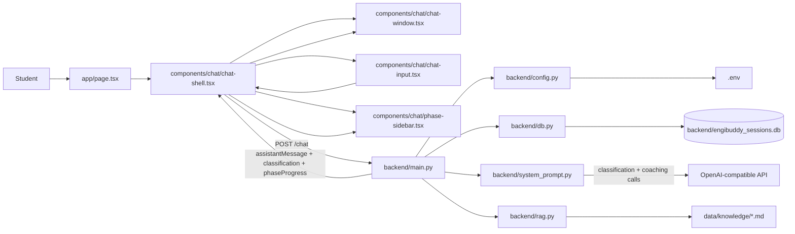
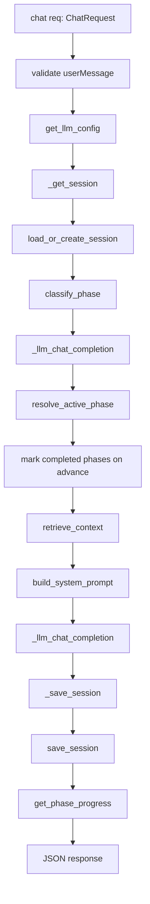
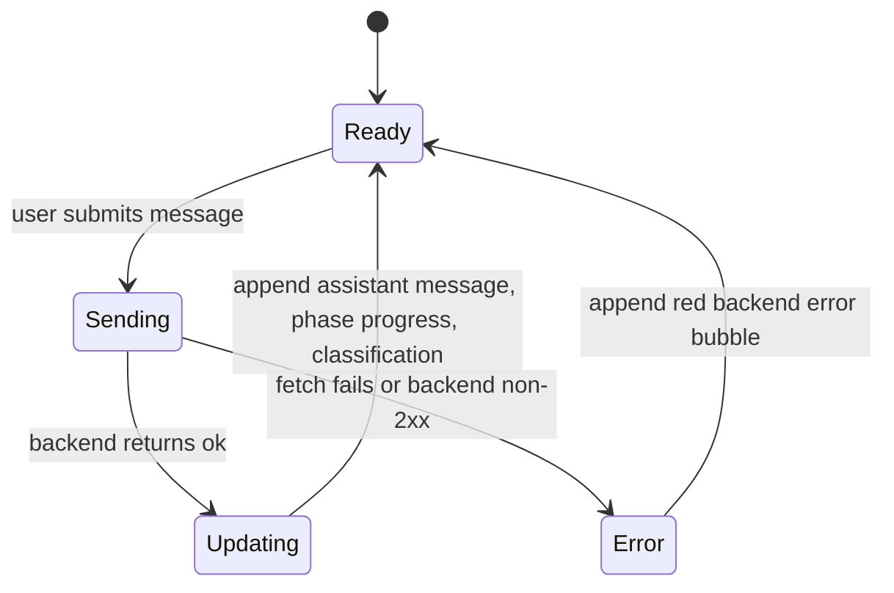
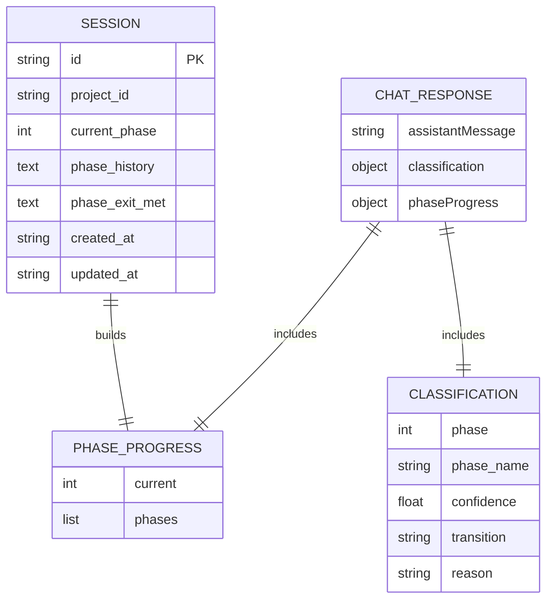
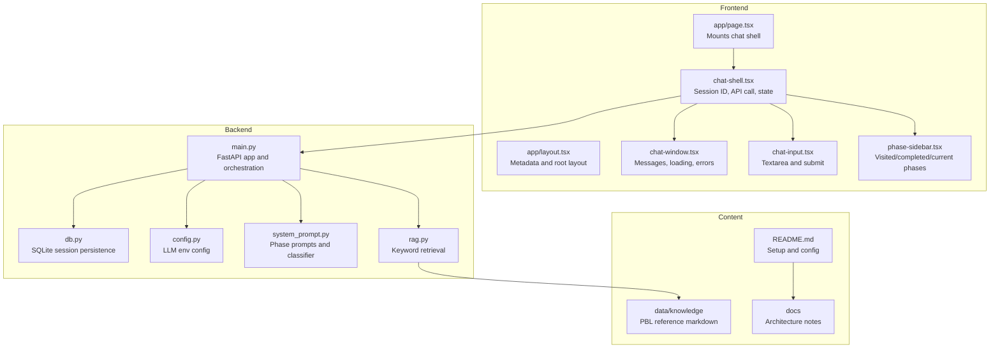

# EngiBuddy Project Graph

This graph maps the current repository at a practical engineering level: runtime flow, core files, persisted state, and external dependencies.

## Runtime Flow

## Backend Call Graph

## Frontend State Graph

## Data Shapes

## File Responsibility Map

## High-Value Change Points

- To adjust phase behavior, start in `backend/system_prompt.py`.
- To change persistence, start in `backend/db.py`, then check `_get_session` and `_save_session` in `backend/main.py`.
- To change the chat request/response UI, start in `components/chat/chat-shell.tsx`.
- To change phase journey visuals, start in `components/chat/phase-sidebar.tsx`.
- To add course knowledge, add or edit Markdown files in `data/knowledge/`.
